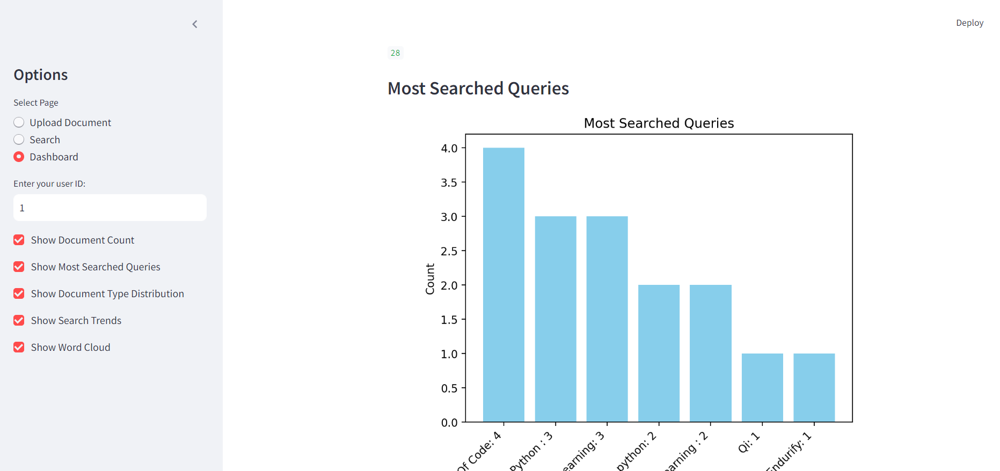
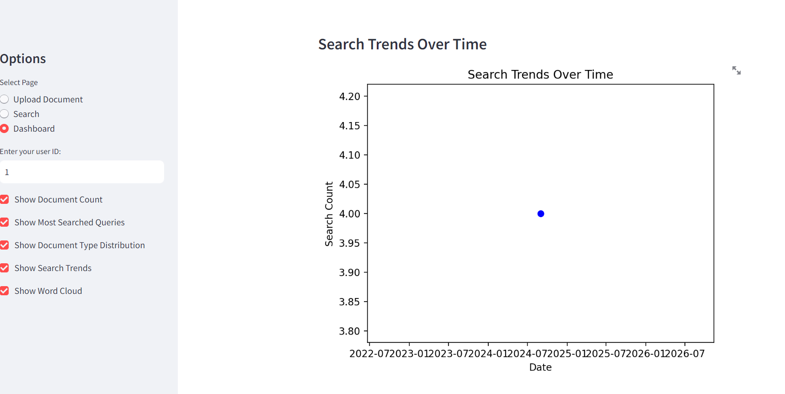

# 📄 **SURAKSHA -- Secure Document Query Application**

Welcome to the **SURAKSHA -- Secure Document Query Application**! This powerful tool allows you to securely upload, search, and analyze documents with ease. Built using Streamlit, this app offers an intuitive interface and various features for managing your document queries efficiently.

## 🕸️🕸️📲 [Live WebApp](https://suraksha.streamlit.app/)

## 📂 Folder Structure:

Here is the folder structure of the project:

```
secure-document-query-app/
│
├── main.py                # Main entry point of the Streamlit application
├── requirements.txt       # List of Python dependencies
│----data/
|       sample_data
|
├── utils/
│   ├── __init__.py        # Initialize the utils package
│   ├── db.py              # Database functions (setup, queries, etc.)
│   |── document_parser.py # Functions for parsing documents
│   |--security.py
|   |--test_fernet.py
|
├──  queries.db
|---- secure_db.sqlite
|-----security.key
│
└── README.md              # This README file

```


## 🌟 **Web App Demo**

[App Demo](recording.mp4) -- click to download Video of web app 

_A visual representation of the app's working interface_


## Screenshots Of Web App:








## 🚀 **Features**

- **🔒 Secure Document Upload**: Upload and store your documents securely.
- **🔍 Advanced Search**: Perform keyword-based searches within your documents.
- **📊 Dashboard**: View insightful metrics and visualizations about your documents and search activities.
  - **Document Count**: Track the number of documents you have uploaded.
  - **Most Searched Queries**: Analyze the most frequently searched queries.
  - **Document Type Distribution**: Visualize the distribution of different document types.
  - **Search Trends**: Observe trends in search activities over time.
  - **Word Cloud**: Explore common terms found in your documents with a visually appealing word cloud.
- **💾 Download History**: Download your chat and search history for record-keeping.

## 🛠️ **Getting Started**

To get started with the **Secure Document Query Application**, follow these steps:


## Installation:


### 1. **Clone the Repository**

```bash
git clone https://github.com/your-username/your-repo.git
cd your-repo

```

### **Set Up the Virtual Environment**:

```
python -m venv venv

```
```
source venv/bin/activate   # On Windows, use `venv\Scripts\activate`
```

### **Install Dependencies**:

```
pip install -r requirements.txt

```

### **Run the Application**:

```
streamlit run main.py

```

## 📋 How It Works:


1.) Upload Document: Use the sidebar to upload PDF, DOCX, or TXT files. The text from the document is parsed and saved securely.

2.) Search Queries: Enter search queries and click "Search" to find relevant results in your documents. The search queries and results are saved for analysis.

3.) Dashboard: Navigate to the Dashboard to view various metrics and visualizations, including document count, most searched queries, document type distribution, search trends, and a word cloud of common terms.
Download History: Download your chat history from the sidebar for offline access.

## 🎨 Visual Enhancements:

The application features a clean and modern UI with:

 
1.) Interactive Charts: Dynamic and responsive charts for better data visualization.

2.) Word Cloud: A visually appealing representation of common terms.

## 🛠️ Technology Stack

1.) Python necessary (❤️)

2.) Streamlit: Framework for building interactive web applications.

3.) Matplotlib & Seaborn: Libraries for creating charts and graphs.

4.) Pandas: Data manipulation and analysis.

5.) WordCloud: For generating word clouds.

6.) SQLite: Lightweight database for storing document and query data.


## 🔗 Links:

1.) Streamlit Community Cloud - Platform for deploying Streamlit apps.

2.) GitHub Repository - Access the source code and contribute.

## 💬 Feedback & Contributions:

We welcome feedback and contributions! If you encounter any issues or have suggestions, please open an issue or pull request on our GitHub repository.

